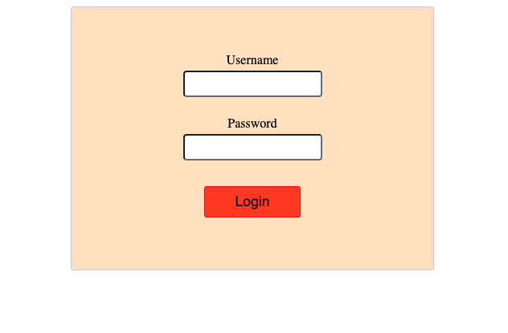
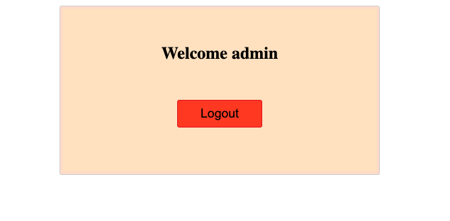
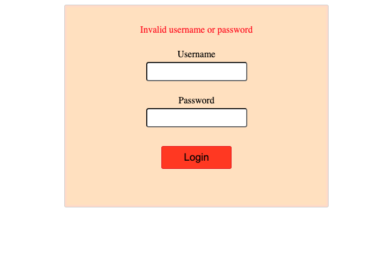

# login-auth-component

[Edit on StackBlitz ⚡️](https://stackblitz.com/edit/react-b6heqo)

### Login Component with useReducer to handle multiple pieces of state

Created Login component that authenticates someone with a username and password.        
If the credentials are not valid, an error message should then be displayed.            

However; if credentials are valid, UI displays  a welcome message to the user.

 

<kbd>Login form</kbd>

 

<kbd>Logged in with credentials</kbd>

 

<kbd>Missing credentials error</kbd>

